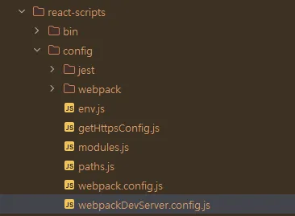

<h1>프로젝트 생성 방법</h1>

```bash
npx create-react-app web
```

<p>root경로에 .gitignore 추가</p>
<pre>
# 무시하지 않을 항목들
!web/src/
!web/public/
!web/package.json
!web/package-lock.json
# intellij file
/.idea
.log
#  macOS file
.DS_Store
# testing with `Jest`
/coverage
# production
/web/build
# misc
/web/node_modules
/web/.env
/web/.env.*
# dependencies
/web/.pnp.*
/web/.pnp.js

npm-debug.log*
yarn-debug.log*
yarn-error.log*
</pre>

<p>Git의 인덱스에서 commit 예외하려는 것 제거</p>

```bash
git rm --cached -r .idea
git commit -m "first commit : Refresh .gitignore rule"
```

<h2>1. web 폴더로 가서 React 시작하기</h2>

```bash
cd web
npm run start
```

<h2>2. DeprecationWarning (사용 중단 경고)</h2>
<pre>
[DEP_WEBPACK_DEV_SERVER_ON_AFTER_SETUP_MIDDLEWARE] DeprecationWarning: 'onAfterSetupMiddleware' option is deprecated. Please use the 'setupMiddlewares' option.
[DEP_WEBPACK_DEV_SERVER_ON_BEFORE_SETUP_MIDDLEWARE] DeprecationWarning: 'onBeforeSetupMiddleware' option is deprecated. Please use the 'setupMiddlewares' option.
</pre>


```jsx
onBeforeSetupMiddleware(devServer) {
  // Keep `evalSourceMapMiddleware`
  // middlewares before `redirectServedPath` otherwise will not have any effect
  // This lets us fetch source contents from webpack for the error overlay
  devServer.app.use(evalSourceMapMiddleware(devServer));
  if (fs.existsSync(paths.proxySetup)) {
    // This registers user provided middleware for proxy reasons
    require(paths.proxySetup)(devServer.app);
  }
},
onAfterSetupMiddleware(devServer) {
  // Redirect to `PUBLIC_URL` or `homepage` from `package.json` if url not match
  devServer.app.use(redirectServedPath(paths.publicUrlOrPath));
  // This service worker file is effectively a 'no-op' that will reset any
  // previous service worker registered for the same host:port combination.
  // We do this in development to avoid hitting the production cache if
  // it used the same host and port.
  // https://github.com/facebook/create-react-app/issues/2272#issuecomment-302832432
  devServer.app.use(noopServiceWorkerMiddleware(paths.publicUrlOrPath));
},
```

<p>위의 내용을 제거하고 아래와 같이 변경한다. (git에 올라가지 않기 때문에) 임의로 수정 진행</p>

```jsx
setupMiddlewares: (middlewares, devServer) => {
  if (!devServer) {
    throw new Error('webpack-dev-server is not defined')
  }

  if (fs.existsSync(paths.proxySetup)) {
    require(paths.proxySetup)(devServer.app)
  }

  middlewares.push(
      evalSourceMapMiddleware(devServer),
      redirectServedPath(paths.publicUrlOrPath),
      noopServiceWorkerMiddleware(paths.publicUrlOrPath)
  )

  return middlewares;
},
```

<h2>3. babel-preset-react-app 관련 경고</h2>
<pre>
One of your dependencies, babel-preset-react-app, is importing the
"@babel/plugin-proposal-private-property-in-object" package without
declaring it in its dependencies.
</pre>

```bash
npm install --save-dev @babel/plugin-proposal-private-property-in-object
npm remove @babel/plugin-proposal-private-property-in-object
```