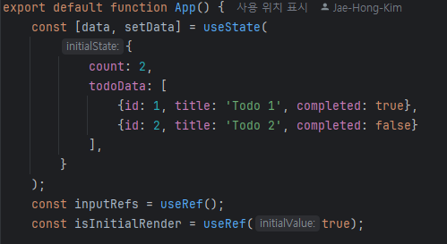
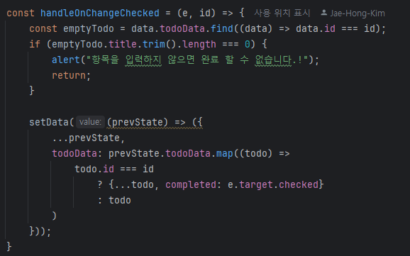

<h1>함수형 컴포넌트(Function Component)</h1>

<h2>TODO APP 만들기</h2>
[JS로 만든 Todo App](https://github.com/newfly101/todo-clone)

<pre>
위의 링크에 있는 내용물을 Function형 Component를 활용한 React로 구현
</pre>

    <li>기본 기능 : 항목을  state로 관리하여, state의 배열로 저장함</li>
    <li>기본 기능 : 항목 추가, 삭제, 변경을 원활하게 할 수 있음</li>
    <li>기본 기능 : 항목이 완료되면 수정x, 삭제만 가능하게 변경</li>

<pre>
    <li>예외처리1 : 항목을 추가할 때 빈 항목의 이름이 없으면 추가되지 않게 함</li>
    
</pre>
<pre>
    <li>예외처리2 : 항목이 입력되지 않았을 때 완료되지 않게 함</li>
    
</pre>
<pre>
    <li>예외처리3 : 항목을 달성하면, 변경되지 않도록 &lt;label&gt;로 변경시킴 </li>
    
</pre>
<pre>
    <li>예외처리4 : 항목을 달성하면, 변경되는 버튼이 보이지 않게 됨 </li>
    
</pre>

<h2>주요 학습 내용</h2>
<pre>
    <li>useState()로 View의 조정을 시행(추가, 삭제, 변경 전부 State 값)</li>
    
</pre>
<pre>
    <li><code>.map() .filter() .find()</code>를 활용한 값 저장 및 활용</li>
    
</pre>
<pre>
    <li>Spread Operator을 활용한 이전 object data를 포함한 데이터 set 유지</li>
    
    
</pre>
<pre>
    <li>삼항 연산자 <code>?</code> 를 활용한 동적 조건 처리</li>
    
</pre>
<pre>
    <li>useEffect()를 활용한 data 변경 시 추적</li>
    
</pre>
